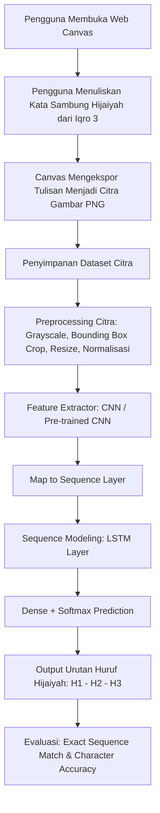

# Dokumentasi Skripsi: Pengenalan Huruf Hijaiyah Sambung

> **Catatan Dokumen:** Dokumen ini adalah catatan penelitian yang telah disinkronkan dengan arahan dan jawaban dari Dosen Pembimbing (**Pak Zain**) serta kolaborator (**Mas Nadhif**) melalui komunikasi per 5–9 September 2026.
> Dokumen ini memisahkan secara tegas antara fakta yang sudah terkonfirmasi dosen, pendekatan teknis yang disepakati, dan hal-hal teknis eksperimental yang masih perlu disusun.

---

**Tanggal Pembuatan:** 2026-09-08  
**Terakhir Diperbarui:** 2026-09-11  
**Status Dokumen:** Telah Disinkronkan dengan Arahan Dosen Pembimbing (Pak Zain) & Ditambahkan Referensi Dataset Publik (Hijja2)

---

## Daftar Isi

1. [Identitas Penelitian](#1-identitas-penelitian)
2. [Judul Sementara dan Arahan Metode](#2-judul-sementara-dan-arahan-metode)
3. [Gambaran Penelitian](#3-gambaran-penelitian)
4. [Masalah Penelitian & Batasan Masalah](#4-masalah-penelitian--batasan-masalah)
5. [Input dan Canvas](#5-input-dan-canvas)
6. [Bentuk Tulisan Hijaiyah dan Batasan Materi](#6-bentuk-tulisan-hijaiyah-dan-batasan-materi)
7. [Output dan Urutan Karakter](#7-output-dan-urutan-karakter)
8. [Multi-Label vs Sequence Recognition (Sintesis Arahan Dosen)](#8-multi-label-vs-sequence-recognition-sintesis-arahan-dosen)
9. [Dataset](#9-dataset)
10. [Paper Acuan Awal](#10-paper-acuan-awal)
11. [Analisis Paper Acuan](#11-analisis-paper-acuan)
12. [Perbandingan dengan Penelitian Saya](#12-perbandingan-dengan-penelitian-saya)
13. [Kajian Literatur dan Target Research Gap](#13-kajian-literatur-dan-target-research-gap)
14. [Research Gap](#14-research-gap)
15. [Transfer Learning dan Perannya](#15-transfer-learning-dan-perannya)
16. [Arsitektur Model: CNN-LSTM](#16-arsitektur-model-cnn-lstm)
17. [Preprocessing Citra](#17-preprocessing-citra)
18. [Evaluasi Model](#18-evaluasi-model)
19. [Status Pertanyaan untuk Dosen](#19-status-pertanyaan-untuk-dosen)
20. [Checklist Status Penelitian](#20-checklist-status-penelitian)
21. [Prioritas Pekerjaan Selanjutnya](#21-prioritas-pekerjaan-selanjutnya)
22. [Rencana Alur Kerja Sistem](#22-rencana-alur-kerja-sistem)

---

## 1. Identitas Penelitian

| Keterangan | Isi | Status |
|---|---|---|
| Nama Mahasiswa | Muchamad Budi Fabiantoro | Terkonfirmasi |
| NIM | 22314050111003 | Terkonfirmasi |
| Program Studi | Informatika | Terkonfirmasi |
| Universitas | Universitas Internasional Semen Indonesia (UISI) | Terkonfirmasi |
| Dosen Pembimbing | **Pak Zain** (+62 821-3925-1309) | Terkonfirmasi via Chat |
| Semester | 7 | Terkonfirmasi |
| Tahun Akademik | 2026/2027 | Terkonfirmasi |

---

## 2. Judul Sementara dan Arahan Metode

### Judul Sementara (Tawaran Awal)
> **"Klasifikasi Multi-Label untuk Pengenalan Huruf Hijaiyah Sambung Menggunakan Transfer Learning"**

### Penyelarasan dengan Arahan Dosen
- **Arahan Metode Dosen:** Dosen secara spesifik menginstruksikan penggunaan arsitektur **CNN-LSTM** (*"pakenya CNN-LSTM"*).
- **Harmonisasi Teknis:** 
  - Judul awal menggunakan terminologi *"Transfer Learning"* dan *"Multi-Label"*.
  - Dalam implementasi arsitektur **CNN-LSTM**:
    1. Komponen **CNN** dapat memanfaatkan pre-trained model (Transfer Learning seperti MobileNet, ResNet, atau VGG) sebagai pengekstraksi fitur visual citra tulisan tangan.
    2. Komponen **LSTM** bertindak sebagai pemodel sekuensial yang mengenali urutan huruf sambung.
  - Secara teoritis tugas ini adalah **Sequence Recognition / CRNN (Convolutional Recurrent Neural Network)** karena output harus mempertahankan urutan ($C_1 \rightarrow C_2 \rightarrow C_3$). Judul sementara tetap dipertahankan sampai pengajuan draft proposal resmi ke dosen.

---

## 3. Gambaran Penelitian

### Deskripsi Umum
Penelitian ini berfokus pada **pengenalan tulisan tangan huruf Hijaiyah yang ditulis secara sambung**. Pengguna menulis huruf Hijaiyah bersambung pada media **Canvas digital**. Canvas mengekspor tulisan tersebut menjadi **satu gambar (image)**, kemudian sistem berbasis **CNN-LSTM** mengenali urutan huruf hijaiyah yang ada di dalam gambar tersebut sesuai materi buku **Iqro 3**.

### Batasan & Ruang Lingkup Penelitian (Terkonfirmasi Dosen)
1. **Fokus Tugas Skripsi Mahasiswa:** Mahasiswa **hanya fokus pada pengembangan model Machine Learning (CNN-LSTM) dan pipeline datasetnya** (*"kamu cuma buat model nya aja"*).
2. **Sistem Gamifikasi / Aplikasi:** Pengembangan antarmuka gamifikasi dan integrasi aplikasi dilakukan oleh peneliti lain/kolaborator (**Mas Nadhif**) (*"iyaa nanti digamifikasi sama nadhif"*).
3. **Media Pengumpulan Data:** Tulisan tangan pada Canvas digital.
4. **Format Data Input Model:** Satu gambar (PNG/JPEG) berisi kata sambung (maksimal 3 huruf) sesuai kaidah **Buku Iqro 3**.

### Contoh Input dan Output
```
Input Canvas (1 Gambar) : ب س م   (ditulis sambung di canvas)
Output Sistem           : [ب, س, م]   (urutan karakter dipertahankan)

Input Canvas (1 Gambar) : ع ل م   (ditulis sambung di canvas)
Output Sistem           : [ع, ل, م]
```

---

## 4. Masalah Penelitian & Batasan Masalah

### Masalah Utama
1. **Karakteristik Sambung Huruf Hijaiyah:** Huruf Hijaiyah mengalami perubahan morfologi bentuk tergantung posisinya (*isolated*, *initial*, *medial*, *final*).
2. **Pengenalan Tanpa Segmentasi Eksplisit:** Pemisahan/segmentasi huruf sambung secara manual pada citra tulisan tangan rentan kesalahan. Penggunaan arsitektur hybrid **CNN-LSTM** ditujukan untuk mengekstraksi representasi spasial sekaligus membaca dependensi urutan temporal secara *end-to-end*.
3. **Preservasi Urutan Karakter:** Model harus mampu menghasilkan label urutan karakter yang tepat ($C_1, C_2, C_3$), bukan sekadar kumpulan himpunan huruf acak.

### Batasan Masalah Resmi
- Penelitian ini tidak mencakup pembuatan sistem gamifikasi utuh, melainkan berfokus penuh pada **pelatihan, pengujian, dan evaluasi akurasi model CNN-LSTM**.
- Kosakata data latih dan data uji dibatasi secara ketat pada seluruh **kata sambung yang ada di buku Iqro 3**.

---

## 5. Input dan Canvas

### Deskripsi Input (Terkonfirmasi Dosen)
- **Status Mekanisme:** **TERKONFIRMASI SEBAGAI GAMBAR (OFFLINE RECOGNITION)**.
- **Konfirmasi Dosen:** *"tulisan tangan yang di canvas"*, *"satu gambar terdiri dari beberapa huruf yang disambung"*.
- **Implikasi Teknis:**
  - Canvas berfungsi sebagai antarmuka input (*drawing interface*).
  - Saat pengguna selesai menulis, canvas diekspor menjadi format citra digital (PNG/JPEG).
  - Pendekatan yang digunakan adalah **Offline Handwriting Recognition** berbasis pemrosesan citra, **bukan** representasi koordinat vektor/stroke time-series.

```
Canvas Digital (User menulis tangan)
  │
  ▼
Ekspor ke Citra / Gambar (PNG/JPEG)
  │
  ▼
Preprocessing Citra (Grayscale, Invert, Resize, Normalisasi)
  │
  ▼
Feature Extraction (CNN / Transfer Learning)
  │
  ▼
Sequence Modeling (LSTM / BiLSTM)
  │
  ▼
Prediksi Urutan Karakter Hijaiyah [H1, H2, H3]
```

---

## 6. Bentuk Tulisan Hijaiyah dan Batasan Materi

### Karakteristik Huruf Hijaiyah Sambung
- Penulisan dari kanan ke kiri.
- Bentuk huruf berubah berdasarkan posisi (Awal / *Initial*, Tengah / *Medial*, Akhir / *Final*).

### Referensi Materi: Iqro 3 (Terkonfirmasi Dosen)
- **Dasar Acuan:** Buku **Iqro 3** menjadi standar kata/kombinasi huruf yang digunakan.
- **Panjang Sambungan:** Mengikuti kata sambung di buku **Iqro 3** (kata terdiri dari 2 hingga 3 huruf sambung per gambar).
- **Tujuan Pembatasan:** Menjaga kompleksitas data agar terfokus pada pengenalan kombinasi huruf dasar bersambung sebelum melangkah ke kata panjang/kalimat Al-Qur'an.

---

## 7. Output dan Urutan Karakter

- Output sistem adalah representasi sekuensial dari huruf-huruf yang terdeteksi:
  $$\text{Output} = [C_1, C_2, C_3]$$
- Urutan karakter adalah kunci utama: sistem harus memprediksi urutan dari kanan ke kiri sesuai urutan penulisan kata Arab.

---

## 8. Multi-Label vs Sequence Recognition (Sintesis Arahan Dosen)

### Klarifikasi Dosen Mengenai Istilah "Multi-Label" (Chat 9 September 2026)
Mahasiswa telah mengonfirmasikan kepada dosen mengenai dilema bahwa multi-label konvensional tidak mempertahankan urutan dan tidak dapat menangani huruf berulang. 

**Respon & Penjelasan Dosen (Pak Zain):**
1. **Dosen membenarkan analisis mahasiswa:** *"Iyaa kyk gitu bener, 1 input dia bisa merepresentasi 3 huruf."*
2. **Definisi "Multi-Label" dalam konteks dosen:** 
   - Istilah "multi-label" digunakan dosen untuk membedakan penelitian ini dari penelitian terdahulu yang *single-label* (1 gambar = 1 huruf tunggal).
   - Pada penelitian ini, **1 gambar input memuat beberapa label huruf sekaligus (hingga 3 huruf)**.
   - Dosen menegaskan batasan: *"Kalo multi-label itu maksudnya gini: Jadi kamu ndak perlu buat dataset untuk semua huruf, Anda cuma perlu buat dataset seperti yang ada di Iqro 3."*

### Harmonisasi Judul dan Pendekatan Metodologi
- **Pada Dokumen & Judul Resmi:** Tetap menggunakan judul yang direkomendasikan dosen: **"Klasifikasi Multi-Label untuk Pengenalan Huruf Hijaiyah Sambung Menggunakan Transfer Learning"**.
- **Pada Metodologi & Arsitektur Teknis:** Diterapkan menggunakan **CNN-LSTM (Sequence Recognition / Multi-Output Temporal)** agar:
  1. Urutan penulisan dari kanan ke kiri ($C_1 \rightarrow C_2 \rightarrow C_3$) tetap terjaga secara ketat.
  2. Pengulangan huruf (misal $ب - ب - م$) dapat dikenali pada posisi urutannya masing-masing.
  3. Sesuai dengan instruksi arsitektur dosen (*"pakenya CNN-LSTM"*).

| Aspek | Definisi Dosen ("Multi-Label") | Implementasi Teknis (CNN-LSTM) | Solusi yang Diambil |
|---|---|---|---|
| **Makna Masalah** | 1 gambar merepresentasikan hingga 3 huruf | Sequence / multi-output temporal | **Harmonis** (1 citra menghasilkan urutan label 3 huruf) |
| **Ruang Lingkup Huruf** | Sesuai kata sambung di Iqro 3 | Sesuai kata sambung di Iqro 3 | **Disamakan persis dengan isi buku Iqro 3** |
| **Urutan Huruf** | Mengikuti urutan kata di Iqro 3 | Dimodelkan oleh lapisan LSTM | **Urutan dipertahankan melalui LSTM** |
| **Arsitektur Model** | CNN-LSTM | CNN (Spatial) + LSTM (Temporal) | **CNN-LSTM (CRNN)** |

---

## 9. Dataset

### 9.1 Dataset Primer: Pengumpulan Mandiri Canvas Iqro 3 (Terkonfirmasi Dosen)
- **Sumber Data:** Pengumpulan data mandiri melalui media Canvas digital oleh penulis/responden.
- **Cakupan Kata:** **Disamakan persis dengan semua isi kombinasi huruf sambung yang ada di buku Iqro 3** (Dosen: *"iyaa betul"*). Peneliti **tidak perlu** membuat dataset untuk seluruh kemungkinan permutasi huruf Hijaiyah, melainkan hanya menyalin kosakata sambung yang ada di materi Iqro 3.
- **Format Sampel:** Gambar citra digital (RGB/Grayscale PNG) hasil ekspor canvas.
- **Jumlah Karakter per Gambar:** Mengikuti kata sambung di Iqro 3 (maksimal 3 huruf per kata/gambar).

### 9.2 Dataset Sekunder / Benchmark Pendukung: Hijja2
Untuk mendukung pra-pelatihan (*pre-training*), augmentasi data, maupun perbandingan benchmark bentuk huruf individual, penelitian ini mencatat ketersediaan dataset publik **Hijja2**.

| Parameter | Detail Dataset Hijja2 |
|---|---|
| **Nama Dataset** | **Hijja2** (*Handwritten Arabic Characters Dataset*) |
| **Tautan Repository** | [https://github.com/israksu/Hijja2](https://github.com/israksu/Hijja2) |
| **Pengumpul / Penulis** | Siswa-siswi sekolah dasar usia 7–12 tahun di Riyadh, Arab Saudi (variasi tulisan tangan pemula/anak-anak) |
| **Total Sampel** | **47.434 citra** karakter tulisan tangan |
| **Cakupan Kelas** | 29 kelas huruf (28 huruf Hijaiyah standar + Hamzah) |
| **Variasi Posisi Huruf** | **108 bentuk morfologi karakter** yang mencakup seluruh posisi penulisan:<br>1. *Isolated* (Tunggal)<br>2. *Beginning / Initial* (Awal kata)<br>3. *Middle / Medial* (Tengah kata)<br>4. *End / Final* (Akhir kata) |
| **Format Citra** | Grayscale, resolusi pindaian 300 DPI, tersegmentasi per karakter individual ke dalam folder terstruktur |

#### Manfaat & Potensi Integrasi Hijja2 dalam Penelitian Skripsi:
1. **Pre-training Backbone CNN (Domain-Specific Transfer Learning):**
   - Sebelum melatih model CNN-LSTM secara *end-to-end* pada dataset kata sambung Canvas Iqro 3 yang jumlahnya terbatas, lapisan konvolusi (CNN) dapat di-training terlebih dahulu menggunakan Hijja2.
   - Hal ini membuat model CNN sudah memiliki bobot pemahaman (*feature representations*) yang sangat kuat terhadap variasi bentuk huruf Hijaiyah di semua posisi (awal, tengah, akhir, tunggal).
2. **Pembuatan Kata Sambung Sintetis (*Synthetic Word Generation*):**
   - Karakter-karakter individual pada posisi *Beginning*, *Middle*, dan *End* dari dataset Hijja2 dapat digabungkan secara terprogram untuk menghasilkan ribuan variasi citra kata sambung sintetis sebagai data latih tambahan (*data augmentation*).
3. **Representasi Tulisan Anak/Pemula:**
   - Karena Hijja2 ditulis oleh anak-anak usia sekolah dasar, karakteristik goresan kuas/pensil memiliki kemiripan tinggi dengan pengguna target media pembelajaran Iqro (pemula/anak-anak).

### 9.3 Checklist Desain Dataset
- [x] Sumber acuan materi utama: Iqro 3 *(Terkonfirmasi Dosen)*
- [x] Format penyimpanan: Gambar / Image *(Terkonfirmasi Dosen)*
- [x] Batasan kata: Disamakan persis dengan kata sambung di buku Iqro 3 *(Terkonfirmasi Dosen)*
- [x] Batasan panjang: Maksimal 3 huruf per gambar *(Terkonfirmasi Dosen)*
- [x] Sumber dataset sekunder/pre-training: Hijja2 (GitHub: `israksu/Hijja2`)
- [ ] Daftar inventaris seluruh kata sambung dari buku Iqro 3 (transkripsi teks)
- [ ] Jumlah responden / writer penulis data canvas
- [ ] Target total sampel citra primer (Canvas Iqro 3)
- [ ] Rasio pembagian data (Train, Validation, Test — misal 70:15:15 atau 60:20:20)
- [ ] Pipeline augmentasi citra canvas (rotasi kecil, variasi ketebalan goresan, blending karakter Hijja2)

---

## 10. Paper Acuan Awal

| Keterangan | Detail |
|---|---|
| Judul | Optimization of Hijaiyah Letter Handwriting Recognition Model Based on Deep Learning |
| Penulis | Alam Rahmatulloh, Randi Rizal, Ricky Indra Gunawan, Irfan Darmawan, Biki Zulfikri Rahmat |
| Tahun | 2022 |
| Konferensi | ICADEIS 2022 |
| Metode Utama | CNN + Adam Optimizer |
| Dataset | Hijja / Hijja2, AHCD (Karakter Tunggal / Isolated) |
| Hasil | Akurasi Hijja: 91%, AHCD: 98% |

---

## 11. Analisis Paper Acuan

- **Fokus Paper Acuan:** Pengenalan karakter Hijaiyah tulisan tangan tunggal (*isolated character*), 1 gambar = 1 huruf.
- **Keterbatasan Paper Acuan:**
  1. Tidak menangani huruf sambung (*cursive handwriting*).
  2. Tidak memiliki pemodelan sekuensial (LSTM) untuk membaca urutan.
  3. Menggunakan dataset sekunder umum, bukan input canvas interaktif.

---

## 12. Perbandingan dengan Penelitian Saya

| Aspek | Paper Acuan (Rahmatulloh 2022) | Penelitian Saya (Sesuai Arahan Dosen) |
|---|---|---|
| **Media Input** | Dataset publik gambar statis | **Canvas digital interaktif** |
| **Bentuk Karakter** | Huruf tunggal (*isolated*) | **Huruf sambung (*cursive*)** |
| **Jumlah Huruf / Gambar**| 1 karakter per citra | **Maksimal 3 huruf per citra (sesuai kata sambung Iqro 3)** |
| **Materi Rujukan** | Tidak ada rujukan kurikulum | **Iqro 3** |
| **Arsitektur Model** | CNN murni *from scratch* | **CNN-LSTM (dengan opsi Transfer Learning pada CNN)** |
| **Output** | 1 kelas karakter tunggal | **Urutan karakter terprediksi** |

---

## 13. Kajian Literatur dan Target Research Gap

### Ketentuan Dosen Pembimbing (Terkonfirmasi Chat 7/9/2026)
1. **Target Jumlah:** **Minimal ~15 paper**.
2. **Fokus Topik:** **Huruf Hijaiyah Sambung** (*cursive/connected Arabic/Hijaiyah*).
3. **Fleksibilitas Metode:** Metode dalam 15 paper tersebut **tidak harus CNN-LSTM**. Boleh mencakup CNN murni, SVM, HMM, BiLSTM-CTC, Vision Transformer, dll., asalkan objek kajiannya adalah tulisan tangan sambung Arab/Hijaiyah.
4. **Dokumen Pendukung:** Pemetaan 15 paper dan matriks perbandingan gap telah disusun pada file terpisah: [literatur_gap_skripsi.md](file:///c:/Users/fabia/Documents/Kuliah/Skripsi/literatur_gap_skripsi.md).

---

## 14. Research Gap

Berdasarkan telaah literatur dan arahan dosen, terdapat 3 pilar gap penelitian utama:

1. **Gap Representasi Karakter:** Mayoritas literatur pengenalan tulisan tangan hijaiyah berfokus pada *isolated characters* (dataset Hijja/AHCD). Penelitian ini mengisi ruang pengenalan **huruf hijaiyah sambung multi-karakter** tanpa perlu segmentasi manual yang rumit.
2. **Gap Arsitektur (CNN-LSTM pada Canvas):** Penerapan arsitektur hybrid CNN-LSTM sebagian besar diterapkan pada teks dokumen pindaian (*scanned documents*). Penerapannya pada **canvas digital interaktif** untuk edukasi Iqro 3 masih sangat minim.
3. **Gap Kontekstual Iqro 3:** Belum ada penelitian yang secara spesifik mengevaluasi model pengenalan tulisan sambung berbasis kurikulum standar pembelajaran membaca Al-Qur'an (Iqro 3).

---

## 15. Transfer Learning dan Perannya

Dalam arsitektur hybrid **CNN-LSTM**:
- **Pemanfaatan Transfer Learning:** Backbone CNN dapat mengadopsi model *pre-trained* umum (seperti MobileNetV2 atau ResNet berbobot ImageNet) maupun *domain-specific pre-training* (pelatihan awal pada dataset **Hijja2** yang memiliki 47k+ sampel karakter hijaiyah individual) untuk bertindak sebagai ekstraktor fitur spasial (*feature extractor*).
- **Efisiensi & Mitigasi Data Terbatas:** Mengingat dataset canvas yang dikumpulkan sendiri memiliki ukuran terbatas, penggunaan Transfer Learning mempercepat konvergensi dan mencegah *overfitting* pada lapisan konvolusi sebelum fitur diteruskan ke lapisan recurrent LSTM.

---

## 16. Arsitektur Model: CNN-LSTM

Arsitektur yang ditetapkan dosen adalah **CNN-LSTM** (famili model CRNN):

```
Citra Input Canvas [W x H x 1/3]
       │
       ▼
[Lapisan Konvolusi / CNN Feature Extractor]
(Mengekstrak representasi peta fitur visual dari bentuk huruf sambung)
       │
       ▼
[Map-to-Sequence Layer]
(Mengonversi peta fitur visual 2D menjadi representasi urutan vektor 1D)
       │
       ▼
[Recurrent Layer / LSTM / BiLSTM]
(Mempelajari dependensi sekuensial huruf dari kanan ke kiri)
       │
       ▼
[Transcription / Dense Layer + Softmax]
(Memprediksi probabilitas urutan kelas karakter huruf Hijaiyah)
       │
       ▼
Output: Daftar Urutan Huruf [H1, H2, H3]
```

---

## 17. Preprocessing Citra

Karena input canvas menghasilkan citra gambar 2D (Offline Recognition), tahapan preprocessing terfokus pada pengolahan citra digital:
1. **Grayscale & Binarization:** Mengubah citra canvas ke format biner (hitam-putih) atau greyscale.
2. **Crop & Bounding Box:** Memotong margin kosong pada canvas agar tulisan terpusat.
3. **Resize dengan Padding Rasio Aspek:** Menyesuaikan resolusi gambar ke dimensi input CNN (misal $128 \times 64$ atau $224 \times 224$) tanpa merusak proporsi tulisan.
4. **Normalisasi:** Penskalaan nilai piksel ke rentang $[0, 1]$ atau $[-1, 1]$.

---

## 18. Evaluasi Model

Karena masalah telah dikonfirmasi sebagai **Sequence Recognition (CNN-LSTM)**, metrik evaluasi disesuaikan:

### Metrik Utama (Sequence Recognition)
1. **Sequence Accuracy / Exact Match:** Proporsi sampel di mana seluruh urutan huruf diprediksi tepat secara persis (misal $[ب, س, م]$ benar semua).
2. **Character Accuracy (Akurasi per Karakter):** Mengukur akurasi prediksi huruf individual terlepas dari kesalahan pada huruf sebelahnya.
3. **Character Error Rate (CER):** Menghitung rasio jarak Levenshtein (substitusi, delesi, insersi) terhadap panjang target karakter.

### Metrik Multi-Label Tambahan (Opsional)
- Jika output juga dievaluasi berdasarkan keberadaan himpunan huruf tanpa memandang urutan: *Precision*, *Recall*, *F1-score*, dan *Hamming Loss*.

---

## 19. Status Pertanyaan untuk Dosen

| Kode | Aspek Pertanyaan | Status | Ringkasan Jawaban Dosen |
|---|---|---|---|
| **P1** | Format penyimpanan Canvas (Image vs Stroke) | **TERJAWAB** | **Gambar (Image)** (*"satu gambar terdiri dari beberapa huruf yang disambung"*) |
| **P2** | Istilah Multi-Label vs Sequence Recognition | **TERJAWAB & DIHARMONISASI** | Dosen membenarkan analisis mahasiswa (*"Iyaa kyk gitu bener"*); makna multi-label menurut dosen adalah 1 gambar memuat hingga 3 huruf; implementasi teknis tetap CNN-LSTM (Sequence) |
| **P3** | Jumlah huruf per sampel | **TERJAWAB** | Mengikuti kata di Iqro 3 (maksimal 3 huruf) |
| **P4** | Batasan minimum/maksimum huruf | **TERJAWAB** | Sesuai kata sambung di Iqro 3 (biasanya 2–3 huruf) |
| **P5** | Apakah ada huruf berulang | **TERJAWAB** | Mengikuti kata-kata yang ada di Iqro 3 (disamakan persis dengan buku Iqro 3) |
| **P6** | Cakupan dataset huruf sambung | **TERJAWAB** | **Disamakan persis dengan seluruh kata sambung di Iqro 3**; tidak perlu membuat dataset untuk seluruh kombinasi huruf |
| **P7** | Target kajian literatur gap | **TERJAWAB** | Minimal **15 paper**, fokus huruf hijaiyah sambung (metode bebas) |
| **P8** | Draft awal skripsi dari dosen | **TERJAWAB** | Tidak ada draft dari dosen (*"Draft apa?"*); mahasiswa yang menyusun proposal mandiri |
| **P9** | Pembagian peran & lingkup aplikasi gamifikasi | **TERJAWAB** | Mahasiswa hanya membuat model AI (*"kamu cuma buat model nya aja"*); gamifikasi dikembangkan oleh kolaborator (Mas Nadhif) |

---

## 20. Checklist Status Penelitian

### Sudah Diketahui / Dikonfirmasi Dosen
- [x] Media input: Canvas digital
- [x] Format data input: Satu gambar (Image / Offline Recognition)
- [x] Objek kajian: Tulisan tangan huruf Hijaiyah sambung
- [x] Batasan kata: Disamakan persis dengan kata sambung di buku Iqro 3 (maksimal 3 huruf)
- [x] Rujukan kurikulum data: Buku Iqro 3
- [x] Metode utama yang ditentukan: **CNN-LSTM**
- [x] Target literatur gap: Minimal 15 paper tentang huruf hijaiyah sambung
- [x] Pembagian peran/lingkup: Mahasiswa hanya fokus pada **pengembangan model AI (CNN-LSTM)** (*"kamu cuma buat model nya aja"*); gamifikasi dikembangkan oleh kolaborator (**Mas Nadhif**)
- [x] Dosen pembimbing: Pak Zain

### Perlu Dirumuskan Sendiri oleh Mahasiswa
- [ ] Daftar inventaris seluruh kata sambung dari buku Iqro 3
- [ ] Desain arsitektur detail layer CNN dan layer LSTM
- [ ] Pemilihan model pre-trained CNN untuk Transfer Learning (misal MobileNetV2)
- [ ] Jumlah responden / pengumpul data tulisan tangan canvas
- [ ] Penyusunan dokumen Draft Proposal / Gambaran Awal Skripsi (1-2 halaman) untuk diajukan ke Pak Zain

---

## 21. Prioritas Pekerjaan Selanjutnya

| No | Tugas | Keterangan |
|---|---|---|
| **1** | **Inventarisasi Materi Iqro 3** | Mengetik dan merekap seluruh kata sambung yang ada di buku Iqro 3 ke dalam tabel untuk dijadikan daftar acuan dataset tulisan tangan canvas. |
| **2** | **Menyelesaikan 15 Paper Literatur Gap** | Melengkapi kajian 15 paper pada [literatur_gap_skripsi.md](file:///c:/Users/fabia/Documents/Kuliah/Skripsi/literatur_gap_skripsi.md) yang berfokus pada huruf hijaiyah sambung. |
| **3** | **Menyusun Ringkasan Proposal Skripsi (1–2 Halaman)** | Menyiapkan dokumen ringkas berisi latar belakang, dataset Iqro 3, metode CNN-LSTM, dan pembagian lingkup (model AI oleh Fabian, gamifikasi oleh Mas Nadhif) untuk persetujuan Pak Zain. |
| **4** | **Koordinasi dengan Mas Nadhif** | Menyamakan format data input-output dan spesifikasi model agar mudah diintegrasikan ke modul gamifikasi buatan Mas Nadhif. |
| **5** | **Prototyping Modul Canvas & Pipeline Model** | Membuat antarmuka canvas sederhana untuk mengumpulkan citra kata sambung dan membangun baseline model CNN-LSTM. |

---

## 22. Rencana Alur Kerja Sistem


